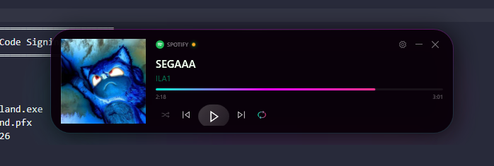
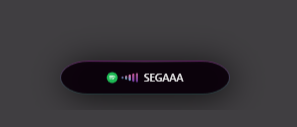
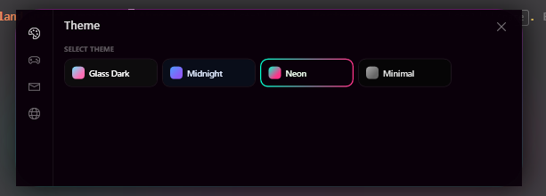

# DynamicIsland.widget

A modern, minimal, and reactive music widget for Windows.

Built to feel like a native system feature — not just another app.

---

## ✨ What it looks like

  

---

## 🫧 Bubble Mode

  

* Compact floating capsule
* Shows current track instantly
* Expands automatically when new music starts

---

## 🎧 Full Player

  

* Album cover
* Track & artist
* Smooth progress bar
* Playback controls

---

## ⚙️ Settings

  

* Clean integrated panel
* Multiple themes
* Behavior customization

---

## 🚀 Features

* 🎧 Detects music from Spotify, browsers, and more
* 🫧 Smart bubble that expands on new tracks
* 🎨 Neon and minimal themes
* ⚡ Smooth animations and transitions
* 🪟 Always-on-top widget
* 🎛️ Integrated settings UI

---

## 🧠 Smart Behavior

DynamicIsland.widget reacts to your system:

* New track → expands automatically
* No activity → minimizes to bubble
* Playback changes → updates instantly

---

## 📦 Download

👉 Go to **Releases** and download the latest version.

---

## 💻 Requirements

* Windows 10 / 11
* Active media session (Spotify, browser, etc.)

---

## ⭐ Support

If you like it:

* ⭐ Star the repo
* Share it
* Give feedback

---

## 💬 Final

Designed to be subtle, responsive, and alive.

---
